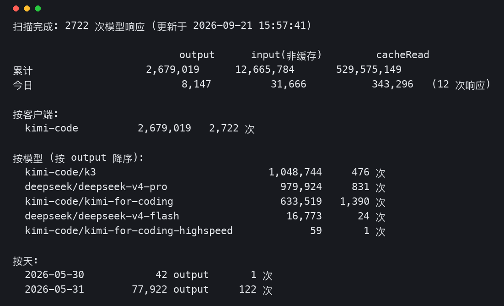

# kimi-code-token-monitor

> [English](README.md) · **中文**

统计并实时监控**扣 Kimi Code 会员额度**的 token 消耗，覆盖三个客户端的本地日志。零依赖，Python 3.8+，单文件 CLI。



## 快速开始

```bash
git clone https://github.com/WU928-spec/kimi-code-token-monitor.git
cd kimi-code-token-monitor

# 一次性全量统计（三个客户端一起）
python3 kimi_tokens.py stats

# 终端实时监控（每 2 秒刷新，Ctrl+C 退出）
python3 kimi_tokens.py watch
```

## 支持的数据源

| 客户端 | 日志位置 | 格式 | 过滤 |
|---|---|---|---|
| kimi-code | `$KIMI_CODE_HOME`（默认 `~/.kimi-code`）`/sessions/**/wire.jsonl` | `usage.record` | 全部计入 |
| claude-code | `$CLAUDE_CONFIG_DIR`（默认 `~/.claude`）`/projects/**/*.jsonl` | Anthropic `usage` | 仅 `model` 含 kimi 的请求 |
| codex | `$CODEX_HOME`（默认 `~/.codex`）`/**/*.jsonl`（含 `archived_sessions`） | `last_token_usage` / `total_token_usage` / `token_usage` | 仅会话模型为 kimi 的文件 |

通过 Claude Code / Codex CLI 使用 kimi-for-coding 模型时，扣的同样是 Kimi Code 会员额度，这些用量会被一并统计。

## 命令

| 命令 | 说明 |
|---|---|
| `stats` | 全量统计：累计/今日总量、按客户端、按模型、按天分布 |
| `stats --json out.json` | 额外导出 JSON（含完整结构化数据） |
| `stats --csv out.csv` | 额外导出按天 CSV |
| `watch` | 终端实时监控，状态落盘，重启不重复计数 |
| `watch --interval 5` | 自定义刷新间隔（秒） |
| `--root PATH` | kimi-code 日志根目录 |
| `--claude-root PATH` / `--codex-root PATH` | 对应客户端日志根目录 |
| `--no-claude` / `--no-codex` | 关闭某个客户端的统计 |

示例：

```bash
python3 kimi_tokens.py stats --json report.json --csv daily.csv
python3 kimi_tokens.py stats --root /path/to/.kimi-code/sessions
```

## 数据原理与去重

kimi-code 的 `usage.record` 每行记录一次模型响应的真实用量（字段：`inputOther` 非缓存输入 / `inputCacheRead` 缓存命中 / `inputCacheCreation` 缓存写入 / `output`），`step.end` 事件里的 usage 是它的副本，已排除。

- **全局行 hash 去重**：重复运行、重启、同一请求被逐字节写入两个文件，都只计一次
- **claude-code**：另按 `message.id` 去重（同一助手消息可能落两行）；`cache_creation` 兼容 `ephemeral_5m/1h` 细分字段
- **codex**：`total_token_usage` 是**会话累积值**，与运行基线做差取增量；任一字段变小视为计数器重置（compaction/新窗口）；增量为 0 的行是记账噪音，跳过

参考了 [kimi-builders/usage](https://github.com/kimi-builders/usage) 的解析器实现（累积值基线、ephemeral 缓存字段、环境变量路径解析）。

## 文件

- `kimi_tokens.py` — 唯一入口，含 `stats` / `watch` 两个子命令
- `widget_automation.py` — [Kimi Work](https://www.kimi.com) Blueprint Automation 采集脚本，供看板组件定时拉取数据，非独立运行

## 注意事项

- 只统计**本机**日志中的用量；账号额度是多端共享的，其他机器上的消耗不在其中
- 转录中没有配额快照（`used_ratio` 等），无法从本地推算账号剩余额度
- 旧会话被清理后用量记录会消失，统计反映的是现存日志
- codex 旧版本（2026-05 之前）的 rollout 文件可能不含任何 usage 字段，无法统计
- `watch` 的状态文件 `.kimi_tokens_state.json` 写在运行目录，建议固定在一个目录下运行

## License

[MIT](LICENSE)
